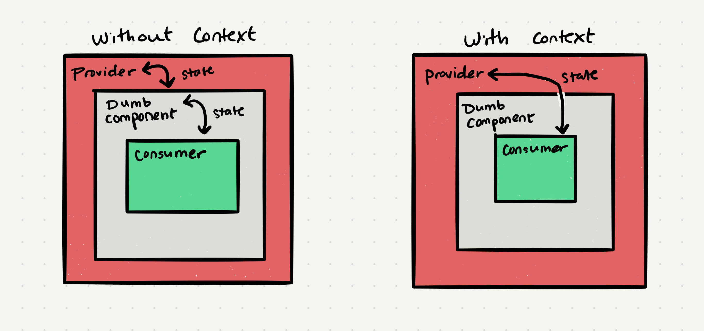

# Class 28 --- Context API

## Lecture Videos

[Tuesday](https://www.youtube.com/watch?v=RVjtksKv5c8) || [Wednesday](https://www.youtube.com/watch?v=OYpLWcexewI)

## Lecture Overview

A big design consideration to make when implementing React components is how the state variables are shared from one component to another. Using the React "Context API", we can create and manage state in a more "**global**" fashion. This allows you to expost the state variables you care about to your entire application, greatly simplifying componenet development.

At the end of this class, you'll be able to:

-   [x] Describe and define global state
-   [x] Understand the provider-consumer relationship
-   [x] Use the React Context API to tactically manage global state

Prior to class, review the readings below and answer the discussion questions in your reading repository.

## Reading

**Context** provides a means of passing state down the component tree through a provider-consumer relationship. A "provider" is the source of the variable; it is where the variable is defined, changed, and updated. A "consumer" has access to the value of that variable, and can use it in other computations / actions. A provider can also expose editing functions to a consumer, so that the consumer can call those functions to change the state variable value. 

Here's an example of how a provider might be structured. As you can see, we're using a new React API function, `createContext()`. 

```jsx
// Context Provider
const MyContext = React.createContext();

class MyProvider extends React.Component {
  constructor(props) {
    super(props);
    this.state = {
      setTitle: this.setTitle,
      title: 'My Website',
    };
  }

  setTitle = title => {
    this.setState({ title });
  };

  render() {
    return (
      <MyContext.Provider value={this.state}>
        {this.props.children}
      </MyContext.Provider>
    );
  }
}

export default MyProvider;
export MyContext;
```

From this provider file, we're making **two exports**; the class component `MyProvider` which creates the state variables, and the *context object*, `MyContext`. This context object is what does the work of sharing the state variables out. Even though our class component is named "provider", the context object is what creates the provider behavior (as shown by `MyContext.Provider`). The provdier asks you to specifiy an object containing the state variables you want to make global. 

When using a context, you can simply import `MyContext` and nest any components that want to access those state variables. 

```jsx
<MyContext>
  <MyConsumer />
</MyContext>
```

However, even if you nest the components in the context, you need a specific way to deliniate that this child component is a *consumer* of those global state variables. To do this, you will need to modify the child components as follows: 

```jsx
// Context Consumer
import { MyContext } from './MyProvider';

class MyConsumer extends React.Component {

  static contextType = MyContext;

  render() {
    return (
      <div>
        <h1>{this.context.title}</h1>
        <button onClick={() => this.context.setTitle('Your Website')}>
          Change Title
        </button>
      </div>
    );
  }
}
```

As you can see, you need to define a `static` called `contextType`. This tells react which context state variables to assign to `this.context`. 

> Note: Context is most helpful with state variables, but there's no restriction on what the `value` property on a provider is set to. So you can even hard code values to create static global variables. 

In the above examples, we've been using class components. However, with the introduction of the Hooks API, you can implement the same feature on functional components using the `useContext` hook. 

```jsx
// Context Provider
import React, { useState} from 'react'
const MyContext = React.createContext();

function MyProvider(props) {
  const [title, setTitle] = useState('My Website'); 
  
  return (
    <MyContext.Provider value={{title, setTitle}}>
      {props.children}
    </MyContext.Provider>
  );
}

export default MyProvider;
export MyContext;
```

```jsx
// Context Consumer
import React from 'react';
import { useContext } from 'react';
import { MyContext } from './MyContext';

function MyConsumer() {
  const context = useContext(MyContext);

  return (
    <div>
      <h1>{context.title}</h1>
      <button onClick={() => context.setTitle('Your Website')}>
        Change Title
      </button>
    </div>
  );
}
```

To illustrate again the benefit of context over the continual passing of props, take a look at the data flow for the following component structure. 



As you can see, by using the Context API, a provider can send the state directly to *any descendant*. Without using context, the provider could only send the state to components directly in the render function of the provider. This means that components defined or used elsewhere would need to have the state passed down in a chain of parent-child props. 

### External Reading / Viewing

Save or skim through the following links to help broaden your understanding.

| Links                                                        |
| ------------------------------------------------------------ |
| [Context API](https://reactjs.org/docs/context.html)         |
| [Hooks and Context example](https://medium.com/swlh/snackbars-in-react-an-exercise-in-hooks-and-context-299b43fd2a2b) |
| [React Context Links](https://github.com/diegohaz/awesome-react-context) |

## Discussion Questions

Create a new markdown page in your reading notes repo for this class. On that page, answer the following questions. You will not be graded on correctness, but rather on your attempt to answer the question. Once you've created your new page, submit a link to that page using the canvas discussion entry field. Links should be somewhat of the format `https://USERNAME.github.io/reading-notes/class-##-reading`.

1. What is the difference between the variables `MyContext` and `MyProvider` in the examples above? 
2. Why is context useful?
3. Can a component outside of a provider get its context? 
